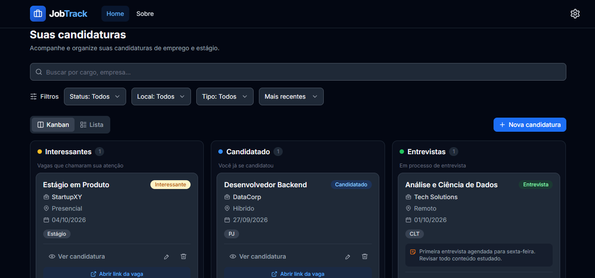
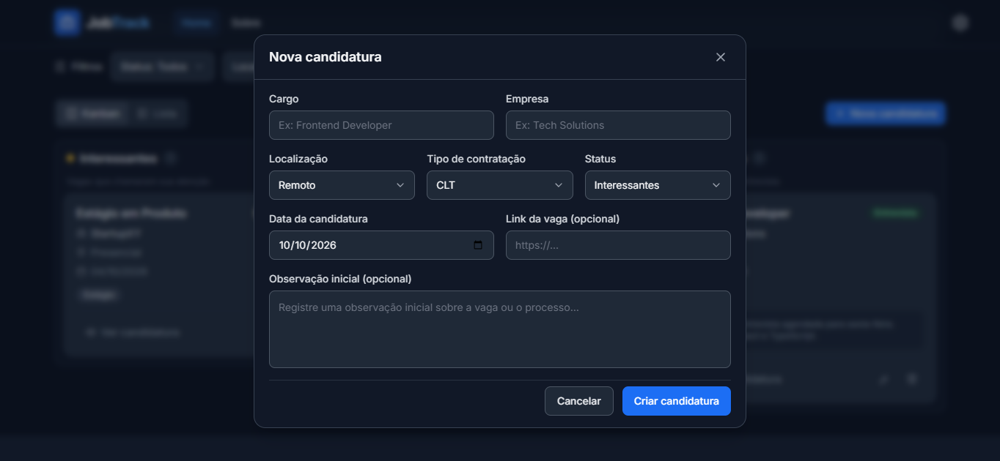
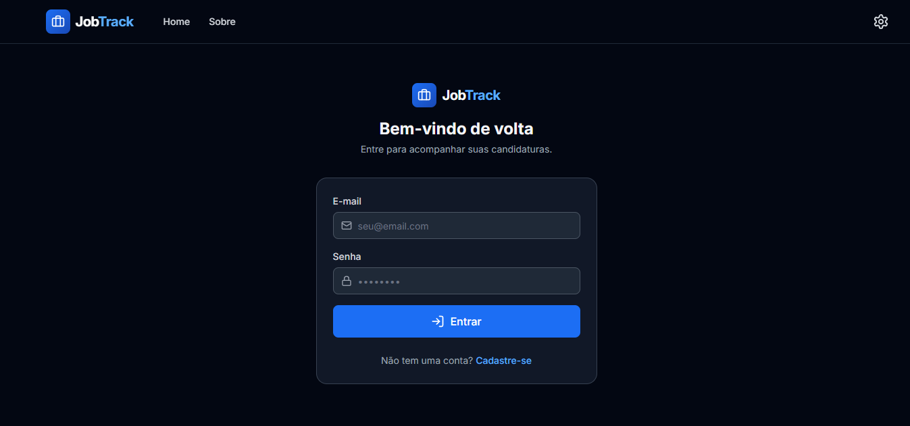
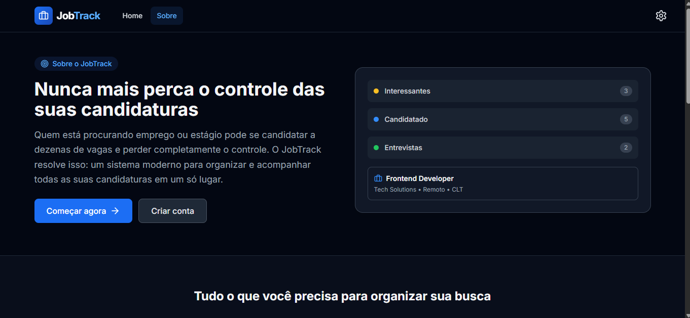

# 💼JobTrack

O JobTrack é uma aplicação frontend para organizar candidaturas de emprego e estágio. Ele ajuda quem está participando de vários processos seletivos a acompanhar vagas, empresas e etapas sem depender de anotações espalhadas.

> **📢Aviso:** vários dados e fluxos apresentados neste projeto são apenas simulações para demonstração. As candidaturas iniciais, empresas, vagas e o fluxo de login/cadastro não representam dados reais nem um serviço de autenticação ativo.

## 💡O problema e a solução

Durante uma busca por emprego, é fácil perder de vista para quais vagas já se candidatou, quando enviou cada candidatura e quais são os próximos passos. O JobTrack reúne essas informações em um painel visual: cada candidatura pode ser acompanhada por status, filtrada e atualizada em um só lugar.

## 👁️Visão geral

### Painel de candidaturas



### Criação de candidatura



### Login



### Sobre o projeto



## ✨Funcionalidades

- Criar, editar e excluir candidaturas.
- Acompanhar o status em um quadro Kanban e mover candidaturas entre etapas.
- Alternar entre as visualizações Kanban e lista.
- Registrar observações e notas, incluindo notas adicionais na tela de detalhes.
- Pesquisar por cargo, empresa, localização e tipo de contratação.
- Filtrar por status, localização e tipo de contrato; ordenar os resultados.
- Informar data da candidatura, link da vaga, localização e tipo de contratação.
- Alternar entre tema claro e escuro, respeitando a preferência salva ou a do sistema.
- Manter dados separados por usuário no armazenamento local do navegador.

## 🏗️Arquitetura

O projeto segue uma organização por responsabilidade:

- `src/pages`: páginas associadas às rotas, como Home, Login, Cadastro e Sobre.
- `src/components`: elementos reutilizáveis da interface, incluindo o quadro Kanban, cartões, formulários e diálogos.
- `src/hooks`: estado e lógica reutilizável, como autenticação, candidaturas e tema.
- `src/services`: persistência e operações de autenticação e candidaturas.
- `src/schemas`: validação dos formulários com Zod.
- `src/constants`: status, opções e dados iniciais de demonstração.
- `src/types`: tipos compartilhados da aplicação.

O TanStack Router controla a navegação no frontend usando rotas com hash. Os formulários usam React Hook Form com validação Zod. As candidaturas são manipuladas pelo serviço de aplicação e persistidas em chaves do `localStorage` associadas ao identificador do usuário.

## 🖥️Tecnologias

- React 18 e TypeScript
- Vite
- Tailwind CSS
- TanStack Router
- React Hook Form e Zod
- Lucide React
- `clsx` e `tailwind-merge`

## ⚙️Como executar

Requisitos: Node.js e npm. Clone ou baixe o projeto e execute os comandos a seguir na pasta que contém este README.

1. Instale as dependências:

   ```bash
   npm install
   ```

2. Inicie o servidor de desenvolvimento:

   ```bash
   npm run dev
   ```

   Abra no navegador o endereço informado pelo Vite.

Para verificar tipos, executar o lint ou gerar a versão de produção:

```bash
npm run typecheck
npm run lint
npm run build
```

## 🚶‍♂️‍➡️Limitações atuais e próximos passos

O JobTrack é atualmente uma aplicação frontend. O fluxo de login e cadastro é demonstrativo: não há validação de credenciais em um servidor, gestão segura de senhas, recuperação de conta ou sessão autenticada de verdade. A separação por usuário usa identificadores guardados localmente e não representa controle de acesso seguro.

As candidaturas e preferências ficam no `localStorage` do navegador. Portanto, não são sincronizadas entre dispositivos ou navegadores, podem ser removidas ao limpar os dados do navegador e não contam com backup ou colaboração. Os dados iniciais de exemplo também não representam candidaturas reais.

Uma evolução futura poderá incluir um backend para autenticação real, armazenamento persistente e sincronização entre dispositivos. Essa integração ainda não faz parte do projeto atual.
